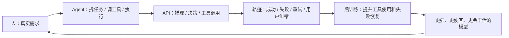

# 视频内容板：DeepSeek、Agent、API、人和数据飞轮

> 目标：这不是逐字旁白稿，而是拍视频时该出现的内容、例子、画面、字幕和论据。
> 风格：有情绪、有立场、有例子，但硬数字不乱编。

## 1. 视频核心情绪

### 观众要立刻感受到

- 不是“又一个 AI 项目介绍”。
- 是“我受够了高价 Agent，所以自己接了一个便宜能跑的方案”。
- DeepSeek 不该只被当成官方聊天框，它应该进入真实 Agent 工作流。
- Agent 时代，价格不是小数点，价格就是门票。
- 谁能让普通人每天都用得起 Agent，谁才是在真正推动 AI 普及。

### 贯穿全片的大字字幕

```text
别再把 DeepSeek 当聊天框了，太浪费了
```

```text
聊天框给你答案，Agent 给你结果
```

```text
Agent 时代：价格就是门票
```

```text
真实任务轨迹，才是模型后训练最需要的燃料
```

## 2. 开场冲突：旗舰很强，但普通人用不起

### 画面

- 快速闪过 GPT-5.5、Claude Opus 4.7、DeepSeek V4 Flash、MiMo V2.5 Pro 的模型卡片。
- 中间切一张“Agent 调工具链路图”：读文件、写代码、调工具、失败、重试。
- 再切账单/价格对比。

### 上屏数据

| 模型 | 适合上屏的点 | 视频表达 |
|---|---|---|
| GPT-5.5 | OSWorld-Verified 78.7%，Terminal-Bench 2.0 82.7% | 旗舰模型非常强 |
| Claude Opus 4.7 | OSWorld-Verified 78.0%，SWE-Bench Pro 64.3% | Claude 仍然是顶级 coding / agent 玩家 |
| DeepSeek V4 Flash | $0.14 / 1M input，$0.28 / 1M output | 便宜到敢拿来日常跑 Agent |
| MiMo V2.5 Pro | 1M context，1T total params / 42B active，面向 agent/coding/long-horizon | 模型公司都在抢 Agent 场景 |

### 这一段的观点

- GPT-5.5 和 Claude 4.7 不是不强，它们非常强。
- 但 Agent 不像聊天，一次任务会烧很多轮调用。
- 普通人真正关心的是：我能不能每天用、放心跑、失败了再试一次。
- DeepSeek V4 Flash 的意义不是“炫榜单”，而是“敢烧”。

### 重点字幕

```text
旗舰模型：强
普通用户：贵
Agent 任务：更贵
```

```text
同样跑 Agent：
GPT-5.5 / Claude 4.7 像打车
DeepSeek V4 Flash 像坐地铁
```

## 3. 例子一：DeepSeek 为什么值得接进 Agent

### 画面

- 左边：DeepSeek 官方聊天框。
- 右边：OpenDeepSeek 页面，模型选中 `hermes-agent`。
- 输入一句任务后，展示本机文件真的出现。

### 展示任务

1. 生成网页
   输入：`帮我生成一个 OpenDeepSeek Agent 演示网页`
   画面：Finder 打开 `index.html`

2. 文件写入
   输入：`写入 /host/OpenDeepSeek-Outputs/browser-e2e/session03.txt`
   画面：文件内容出现
   可用真实产物：`/Users/lauralyu/OpenDeepSeek-Outputs/browser-e2e/session03.txt`

3. 桌面权限边界
   输入：`检查 /host/Desktop 是否可读，不要列出真实文件名`
   画面：回答 yes/no，不泄露隐私

### 这一段要表达

- DeepSeek 官方聊天系统没有充分释放 API 的 Agent 能力。
- DeepSeek V4 Flash 接入 Hermes 后，能跑工具、文件、命令、任务。
- 这个项目的重点不是换皮 UI，而是把便宜模型接进真实执行环境。

### 重点字幕

```text
不是“我建议你创建文件”
是“文件真的出现了”
```

```text
DeepSeek + Hermes = 便宜推理 + 真 Agent 执行
```

## 4. 例子二：MiMo 为什么也在疯狂推 Agent

### 画面

- 展示 MiMo 官网/模型页面。
- 展示 MiMo V2.5 / V2.5 Pro、Token Plan、OpenClaw / Claude Code / OpenCode 兼容字样。
- 如果你愿意，可以打码展示你自己收到的 MiMo token / 开发者额度邮件或控制台。

### 可上屏公开信息

| MiMo 事实点 | 用法 |
|---|---|
| MiMo 官网写 Token Plan 覆盖 V2.5 和 V2 系列 8 个模型 | 说明它在主动铺开发者入口 |
| 官网写兼容 OpenCode、OpenClaw、Claude Code | 说明它不是只做聊天，是冲 Agent 工具链来的 |
| MiMo-V2.5-Pro：1T total params、42B active、1M context | 说明它专门面向长任务和 Agent |
| MiMo-V2.5：原生多模态 + 1M context + browsing / reasoning / execution | 说明它在抢“能看、能想、能行动”的 Agent 场景 |
| 官网邀请奖励：邀请双方可得 $2 API credit，credits 有效 40 天 | 说明它在用额度拉开发者试用 |
| 第三方报道：MiMo-V2.5 / V2.5-Pro MIT 开源，面向 long-running agents、coding、workflow automation | 说明它把 agent 长任务当核心方向 |

### 你的个人体验怎么放

这里用第一人称，不写成公开事实：

```text
我自己也收到了 MiMo 2.5 的开发者 token / 额度。
这件事特别说明问题：模型公司不是做慈善，它们是在让开发者把模型接进真实 Agent 场景里跑。
```

如果提 MiMo 2.0 Pro 免费给 Agent 用好几周：

```text
我之前用 MiMo 2.0 Pro 的时候，就经历过它给 Agent 场景免费/低成本试用一段时间。
很快它又迭代到 MiMo 2.5 Pro。
这不是偶然，这是模型公司在用真实开发者场景加速迭代。
```

注意：这段作为“我的使用经历”，不要写成官方公告。

### 这一段要表达

- MiMo 的例子证明：DeepSeek 不是孤例。
- 模型公司都知道 Agent 数据重要，所以才会：
  - 给开发者额度
  - 接 OpenClaw / Claude Code / OpenCode
  - 强调 long-horizon / tool-call / coding
  - 快速迭代 V2 → V2.5
- 真实 Agent 使用轨迹，比单纯聊天更接近下一代模型需要的数据。

### 重点字幕

```text
为什么 MiMo 要送 token？
因为它也要真实 Agent 场景
```

```text
免费不是终点
免费是让开发者把模型接进真实工作流
```

```text
模型公司抢的不是聊天记录
是 Agent 轨迹
```

## 5. 例子三：Qwen / Coding Plan / Token Plan

### 画面

- 展示“Coding Plan → Token Plan”的对比表。
- 不要攻击，重点放在“成本结构变化”。

### 这一段要表达

- 我理解公司要盈利。
- 但对普通开发者来说，Agent 成本确实越来越敏感。
- Coding Plan 这种模式一旦收紧，大家马上感受到：Agent 不是一次问答，它是持续消耗。
- 这反而证明了 DeepSeek V4 Flash 的价值：价格低，才敢让 Agent 跑起来。

### 重点字幕

```text
公司要盈利，我理解
但普通人跑 Agent，真的需要便宜模型
```

```text
Agent 不是问答
Agent 是持续消耗
```

## 6. 例子四：OpenAI 为什么重视 Agent 工程

### 画面

- 展示 OpenAI Computer-Using Agent / Operator / AgentKit 类页面。
- 展示 OpenClaw 创始人 Peter Steinberger 加入 OpenAI 的新闻标题。

### 这一段要表达

- OpenAI 也知道，下一阶段不只是会聊天，而是会操作电脑、会用工具、会完成任务。
- Peter Steinberger 加入 OpenAI 的意义，不是“某个人改变了一切”，而是说明 Agent 工程经验已经变成模型公司的核心资产。
- 模型公司要的不只是网页语料，它们要真实任务中的行动轨迹。

### 重点字幕

```text
下一代模型拼的不是会不会说
是会不会做
```

```text
Agent 工程经验，已经是模型公司的核心资产
```

## 7. 数据飞轮怎么画

### 推荐图



### 图旁边放的解释词

- 人：不是出题，是提真实任务。
- Agent：不是回答，是拆解并执行。
- API：不是聊天，是每一步推理和工具调用决策。
- 轨迹：成功、失败、重试、纠错，全都重要。
- 后训练：模型学会什么时候用工具、怎么恢复失败、怎么完成长任务。

### 重点字幕

```text
聊天记录教模型怎么说话
Agent 轨迹教模型怎么做事
```

## 8. OpenDeepSeek 在这个飞轮里的位置

### 画面

```text
用户 / 手机 / 浏览器
        ↓
Open WebUI
        ↓
Hermes Agent
        ↓
DeepSeek V4 Flash API
        ↓
本机文件 / 网页 / 周报 / 定时任务 / Skills
```

### 要展示的真实能力

| 能力 | 画面 |
|---|---|
| 生成网页 | 本机出现 `index.html` |
| 文件写入 | 本机出现 `session03.txt` |
| 桌面访问 | 只检查权限，不泄露文件名 |
| 中文周报 | mock 工作项 → 老板版 → 微信 5 行版 |
| Tailscale 手机访问 | 手机打开 OpenDeepSeek |
| Cron / 定时任务 | 展示“可创建任务”，不要现场创建敏感任务 |

### 重点字幕

```text
OpenDeepSeek 不是模型
它是 DeepSeek 进入 Agent 工作流的入口
```

```text
电脑上跑 Agent
手机上也能用
```

## 9. 视频结构建议

| 时间 | 内容 | 画面 | 情绪 |
|---|---|---|---|
| 0:00-0:15 | 别再把 DeepSeek 当聊天框 | 正脸 + 大字标题 | 开火 |
| 0:15-0:45 | Agent 真正贵在哪里 | 工具调用链路 + token 计费 | 共鸣 |
| 0:45-1:20 | GPT-5.5 vs Claude 4.7 vs DeepSeek 价格 | benchmark + 价格表 | 冲击 |
| 1:20-2:00 | OpenDeepSeek 实机演示 | 写文件 / 生成网页 | 证明 |
| 2:00-2:40 | MiMo 例子 | 官网 / token / OpenClaw 兼容 | 多例子加固 |
| 2:40-3:10 | Qwen / Token Plan 例子 | 成本变化图 | 现实压力 |
| 3:10-3:40 | OpenAI / OpenClaw 例子 | 新闻 / CUA 页面 | 行业趋势 |
| 3:40-4:20 | 数据飞轮图 | Mermaid/动画图 | 升维 |
| 4:20-4:50 | 回到 DeepSeek 和 OpenDeepSeek | 项目页面 + GitHub | 收束 |
| 4:50-5:00 | CTA | GitHub / 安装命令 | 行动 |

## 10. 封面文案

### 强情绪版

```text
别再把 DeepSeek 当聊天框了
```

### 价格冲击版

```text
GPT-5.5 很强
但我用 DeepSeek 跑 Agent
```

### 数据飞轮版

```text
模型越用越强？
关键不是聊天，是 Agent
```

### MiMo 多案例版

```text
为什么模型公司都在送 token？
```

## 11. 评论区置顶

```text
这条视频不是说旗舰模型不强，GPT-5.5 和 Claude Opus 4.7 都非常强。
我的重点是：Agent 时代每一步都在烧 token，普通人需要一个每天跑得起的方案。
DeepSeek V4 Flash + Hermes Agent + Open WebUI，就是我现在做 OpenDeepSeek 的原因。
```

## 12. 需要准备的素材

### 屏幕素材

- OpenDeepSeek 首页，显示 `hermes-agent`。
- 浏览器真实对话记录。
- 文件写入产物：`/Users/lauralyu/OpenDeepSeek-Outputs/browser-e2e/session03.txt`
- 网页生成产物：`/Users/lauralyu/OpenDeepSeek-Outputs/browser-e2e/site04/index.html`
- GitHub 项目页。
- DeepSeek pricing 页面。
- Xiaomi MiMo 官网 Token Plan / OpenClaw 兼容页面。
- MiMo token / developer credits 的个人截图，记得打码。
- GPT-5.5 / Claude Opus 4.7 benchmark 和 pricing 页面。
- OpenAI CUA / AgentKit / OpenClaw founder 加入 OpenAI 新闻。

### 拍摄素材

- 正脸开场。
- 手机打开 OpenDeepSeek。
- 桌面端 OpenDeepSeek 生成文件。
- 价格对比图。
- 数据飞轮图。

## 13. 参考来源

- DeepSeek API Pricing：`deepseek-v4-flash` pricing、1M context、Tool Calls。
  https://api-docs.deepseek.com/quick_start/pricing
- DeepSeek API Docs：OpenAI / Anthropic compatible API、Agent integrations。
  https://api-docs.deepseek.com/
- Xiaomi MiMo Home：Token Plan 覆盖 V2.5 / V2 系列模型，兼容 OpenCode、OpenClaw、Claude Code，邀请双方可得 $2 API credits。
  https://mimo.mi.com/
- Xiaomi MiMo Blog：MiMo-V2.5-Pro / MiMo-V2.5 面向 agentic、long-horizon coherence、agency and multimodality。
  https://mimo.xiaomi.com/
- Computerworld：MiMo-V2.5 / V2.5-Pro MIT 开源，面向 long-running agents、coding、workflow automation。
  https://www.computerworld.com/article/4164220/xiaomi-releases-mit%E2%80%91licensed-mimo-models-for-long%E2%80%91running-ai-agents-2.html
- OpenAI GPT-5.5 发布页：GPT-5.5 与 Claude Opus 4.7 benchmark 对比。
  https://openai.com/ro-RO/index/introducing-gpt-5-5/
- OpenAI API Pricing：GPT-5.5 API pricing。
  https://openai.com/api/pricing/
- Anthropic Claude Opus 4.7 发布页：Claude Opus 4.7 pricing 和 benchmark。
  https://www.anthropic.com/news/claude-opus-4-7
- OpenAI Computer-Using Agent：真实世界反馈、OSWorld / WebArena / WebVoyager 等公开指标。
  https://openai.com/index/computer-using-agent/
